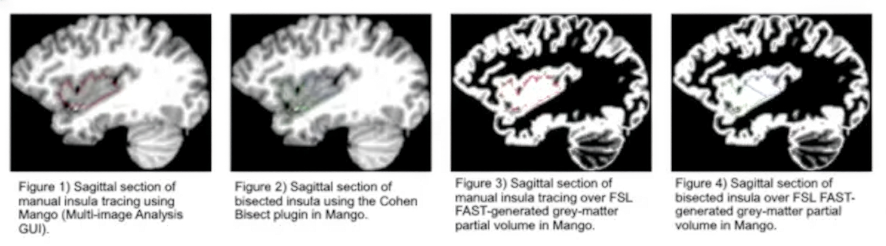

# Cohen Bisect Plugin for Mango
**Anterior-Posterior Insular Cortex Bisection Plugin for Multi-Image Analysis GUI (Mango)**

> **Presented at the Cognitive Neuroscience Society (CNS) 2017** > By Zachary Laborde, David Stephenson, M.S., Allan L. Reiss, M.D., Elliott Beaton, Ph.D., & Jeremy D. Cohen, Ph.D.

---

## Overview
The **Cohen Bisect Plugin** introduces an established geometric bisecting methodology into [Mango (Multi-Image Analysis GUI)](http://ric.uthscsa.edu/mango/). This tool empowers researchers to accurately approximate insular functional subregions using structural MRI.

Previously, the Cohen Bisect algorithm relied on a discontinued brain imaging application known as BrainImageJava (BIJ). This plugin successfully ports that methodology into Mango, providing modern neuroimaging researchers with a reliable, updated tool for insular cortex segmentation and structural analysis. 

## Background
The Insular Cortex is a multimodal brain region with connectivity throughout the brain, involved in a wide variety of cognitive functions including anxiety manifestation and psychosis. Evidence suggests that unique cytoarchitectural subregions within the insular cortex perform distinct functional roles. 

By utilizing a simple geometric bisecting algorithm (Cohen Bisect), researchers can accurately size and locate these subregions to conduct localized functional analyses. 

---

## Technical Implementation
* **Language:** Java (Built using Java SDK 1.6)
* **API:** Mango Plugin API
* **Supported Formats:** Integrates with the universal NIfTI (`*.nii`) format.
* **Processing:** Converts images and Regions of Interest (ROIs) into an iso-voxel matrix (1mm³). Can be used in conjunction with grey matter segmentation tools like FSL FAST.

---

## Installation Instructions

### Prerequisites
* Ensure you have the desktop version of [Mango (Multi-Image Analysis GUI)](http://ric.uthscsa.edu/mango/) installed on your Mac, Windows, or Linux system.

### Step-by-Step Installation
1. **Download the Plugin:**
   * Navigate to the **Releases** section of this GitHub repository. 
   * Download the compiled plugin file (e.g., `.zip` or `.jar`). 
   * Save the downloaded file to a convenient location. **Do not rename the file.**
2. **Access the Plugin Manager:**
   * Open the Mango application.
   * In the main Mango toolbox window, navigate to **Options > Plugin Manager**.
3. **Install the Plugin:**
   * Click the **Add Plugin** button.
   * Browse your file system, select the downloaded plugin file, and confirm. 
4. **Verify and Run:**
   * The Cohen Bisect tool is now accessible via the **Plugins** menu located in the viewer window. 
   * *(If you do not see it, restart the Mango application).*

---

## Usage Guide

1. **Load your MRI Data:** Open your `.nii` structural MRI scan in Mango.
2. **Load/Create ROIs:** Load your pre-traced insular regions of interest.
3. **Run the Bisection:** Navigate to **Plugins > Cohen Bisect** to execute the bisection algorithm.
4. **Review Subregions:** The plugin will generate the separated anterior and posterior volumes.

---

## Validation & Reliability
To ensure the plugin's accuracy, manual insular ROIs were created among a sample of Fragile X Syndrome, Developmental Delay, and Typically Developing children (n=28). ROIs were bisected in both the original BIJ software and Mango, then compared using Intra-class correlation coefficients (ICCs). 

The results demonstrated a **remarkably high level of reliability** between the original BIJ ROI and the converted Mango ROI (Overall ICC = .990), with **no volume lost** during the bisecting process.

### Intra-Class Correlation Coefficient (ICC)
| Region | ICC |
| :--- | :--- |
| **Left Insula** | .995 |
| **Right Insula** | .995 |
| **Left Anterior** | .976 |
| **Right Anterior** | .970 |
| **Left Posterior** | .994 |
| **Right Posterior** | .984 |

### Mango-to-BIJ Proportional Volumes
| ROI | BIJ (mm³) | Mango (mm³) | Percent Volumes (Mango/BIJ) |
| :--- | :--- | :--- | :--- |
| **Total** | 6470.691 | 6359.282 | 98.278% |
| **Anterior** | 3715.923 | 3545.071 | 95.402% |
| **Posterior** | 2754.768 | 2814.201 | 102.157% |

*(Note: The correlation between anterior and posterior segmentations in BIJ and Mango were found to have a confounding variable. Some of this skew may be a result of the change to iso-voxel, which in turn may change the line on which the ROI is split).*

---

## References
* Chang, L.J., Yarkoni, T., Khaw, M.W., & Sanfey, A.G. (2013). Decoding the role of the human insula in human cognition: Functional parcellation and large-scale reverse inference. *Cerebral Cortex*, 23(3), 739-749.
* Cohen, J. D., Mock, J. R., Nichols, T., Zadina, J., Corey, D. M., Lemen, L., Bellugi, U., Galaburda, A., Reiss, A. L., & Foundas, A. L. (2010). Morphometry of human insular cortex and insular volume reduction in Williams syndrome. *Journal of Psychiatric Research*, 44(2), 81–89.
* Cohen, J. D., Nichols, T., Brignone, L., Hall, S. S., & Reiss, A. L. (2011). Insular Volume Reduction in Fragile X Syndrome. *International Journal of Developmental Neuroscience*, 29(4), 489–494.
* Mesulam M.M., Mufson E.J. Insula of the old world monkey II: Afferent cortical input and components of the claustrum. *J Comparative Neurology* 1982a; 212:23–37.

---

## Authors & Affiliations
* **Zachary Laborde** - *Department of Psychology, Xavier University of Louisiana*
* **David Stephenson, M.S.** - *Department of Psychology, University of New Orleans*
* **Allan L. Reiss, M.D.** - *Center for Interdisciplinary Brain Sciences Research, Stanford School of Medicine*
* **Elliott Beaton, Ph.D.** - *Department of Psychology, University of New Orleans*
* **Jeremy D. Cohen, Ph.D.** - *Department of Psychology, Xavier University of Louisiana*

## Acknowledgements
Special thanks to the Xavier University Center for Undergraduate Research and Graduate Office (CURGO) for providing funding to travel to the CNS conference. ROIs were provided by Dr. Allan Reiss from research supported by NIMH grants R01MH050047 and R01MH064708, and T32MH019908. Funding was also provided by the generosity of the Canol Family Fund.
